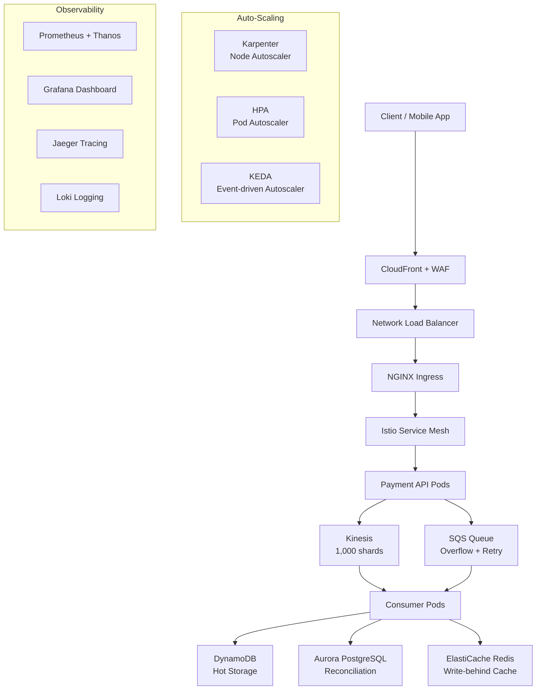

# Tada DevOps Engineer — Technical Assessment

## Handling Extreme Traffic Spikes: 1 TPS → 1,000,000 TPS

**Platform:** Amazon EKS + AWS  
**Candidate:** Mujaddid  
**Date:** April 2026

---

## Overview

This repository contains the complete technical assessment for the
DevOps Engineer position at Tada. The assessment covers the design
and implementation of a payment processing platform capable of
handling traffic spikes from 1 TPS to 1,000,000 TPS within seconds.

---

## Architecture Overview



---

## Repository Structure

```
tada-assessment/
├── section-a/          # Cluster Architecture & Auto-Scaling
├── section-b/          # Networking & Traffic Management
├── section-c/          # Data Layer & Backpressure
├── section-d/          # Observability & Incident Response
├── section-e/          # Chaos Engineering
└── section-f/          # Security, Cost & Post-Spike Operations
```

---

## Section Summary

### Section A: Cluster Architecture & Auto-Scaling (100 pts)

Designed EKS cluster with multi-AZ node groups using Karpenter
for automatic node provisioning. Combined HPA, KEDA, and VPA
for comprehensive pod autoscaling. Pre-warming strategy using
pause pods eliminates cold-start delays during burst traffic.

| File | Purpose |
|------|---------|
| `karpenter-nodepool.yaml` | Node provisioning with Spot/On-Demand mix |
| `hpa.yaml` | Pod scaling based on RPS and CPU |
| `keda-scaledobject.yaml` | Event-driven scaling via SQS and Kinesis |
| `vpa.yaml` | Resource sizing recommendations |
| `topology-spread.yaml` | AZ-balanced pod scheduling |
| `pdb.yaml` | Minimum availability protection |
| `pause-pod.yaml` | Capacity pre-warming |

---

### Section B: Networking & Traffic Management (80 pts)

Full request path: CloudFront → WAF → NLB → NGINX → Istio → Pod.
TLS terminated at CloudFront, mTLS enforced between all pods.
Canary deployment at 95/5 split with automatic circuit breaking.

| File | Purpose |
|------|---------|
| `service-nlb.yaml` | NLB with cross-zone load balancing |
| `nginx-configmap.yaml` | NGINX tuning for 1M TPS |
| `istio-virtualservice.yaml` | Canary traffic split 95/5 |
| `istio-destinationrule.yaml` | Circuit breaker + connection pool |
| `istio-peerauthentication.yaml` | mTLS STRICT mode |
| `waf-rules.tf` | WAF rate limiting + SQLi protection |
| `route53.tf` | Latency-based routing + health checks |

---

### Section C: Data Layer & Backpressure (80 pts)

Kinesis with 1,000 shards handles 1GB/s ingestion. DynamoDB
with shard prefix strategy avoids hot partitions. Redis
write-behind cache reduces DynamoDB pressure by 80%.
Idempotency via DynamoDB conditional PutItem ensures
exactly-once payment processing.

**Kinesis shard calculation:**
```
1,000,000 TPS x 1KB = 1GB/s
1GB/s / 1MB/s per shard = 1,000 shards required
```

| File | Purpose |
|------|---------|
| `kinesis.tf` | Kinesis stream with 1,000 shards |
| `dynamodb.tf` | DynamoDB with hot partition prevention |
| `aurora.tf` | Aurora PostgreSQL for reconciliation |
| `elasticache.tf` | Redis cluster mode write-behind cache |
| `sqs.tf` | SQS queue with DLQ and redrive policy |
| `backpressure.yaml` | Readiness probe backpressure |
| `idempotency.py` | Exactly-once payment processing |
| `istio-downstream-circuit-breaker.yaml` | Circuit breaker for DB calls |

---

### Section D: Observability & Incident Response (80 pts)

Full observability stack: Prometheus + Thanos + Grafana +
OpenTelemetry + Jaeger + Loki. Multi-window burn-rate SLO
alerting detects budget exhaustion within 90 seconds.
Adaptive sampling: 1% normal traffic, 100% errors and slow traces.

| File | Purpose |
|------|---------|
| `prometheus-rules.yaml` | SLO recording + alerting rules |
| `alertmanager-config.yaml` | PagerDuty + Slack routing |
| `otel-collector.yaml` | Telemetry with adaptive sampling |
| `jaeger.yaml` | Distributed tracing |
| `loki.yaml` | Log aggregation |
| `grafana-dashboard.json` | 10-panel real-time dashboard |
| `runbook.md` | Pre-event checklist + incident response |

---

### Section E: Chaos Engineering (80 pts)

Three chaos experiments validate system resilience before the
event. All experiments integrated as hard gates in GitLab CI
pipeline — production deployment blocked if any experiment fails.

| Experiment | What is Tested | Pass Criteria |
|------------|---------------|---------------|
| Pod Kill | Kill 50% pods at 500K TPS | Recovery < 30s, zero data loss |
| AZ Failure | Blackhole entire AZ-1a | Karpenter reprovisions < 60s |
| Aurora Failover | Force DB primary failover | Circuit breaker absorbs ~30s gap |

| File | Purpose |
|------|---------|
| `chaos-pod-kill.yaml` | Experiment 1 — pod resilience |
| `chaos-az-failure.yaml` | Experiment 2 — AZ resilience |
| `chaos-aurora-failover.yaml` | Experiment 3 — DB resilience |
| `gitlab-ci-chaos.yaml` | CI/CD pipeline with chaos gate |

---

### Section F: Security, Cost & Post-Spike Operations (80 pts)

Graceful scale-down with 10-minute stabilization window and
preStop hook prevents transaction loss. Kyverno enforces
security policies at admission time. AWS Budget + Lambda
automatically caps Spot fleet at $500/hr burn rate.

| File | Purpose |
|------|---------|
| `graceful-scaledown.yaml` | Safe scale-down configuration |
| `kyverno-policy.yaml` | Security policies enforcement |
| `network-policy.yaml` | Default deny + explicit allow |
| `secrets-store-csi.yaml` | Secrets Manager with auto-rotation |
| `cost-control.tf` | Budget + Lambda auto-cap |
| `quota-checklist.sh` | AWS quota increase automation |

---

## Key Design Decisions

| Component | Choice | Reason |
|-----------|--------|--------|
| Node autoscaler | Karpenter | Fastest provisioning, Spot/OD mix |
| Pod autoscaler | HPA + KEDA | CPU metrics + queue-driven scaling |
| Ingestion | Kinesis 1,000 shards | Only service sustaining 1GB/s |
| Hot storage | DynamoDB provisioned | No warm-up penalty, ready from second zero |
| Cache | Redis write-behind | 80% DynamoDB pressure reduction |
| Idempotency | DynamoDB conditional PutItem | Atomic exactly-once, no distributed locks |
| Traffic | NLB → NGINX → Istio | L4 → L7 → service mesh layering |
| Chaos | Litmus + CI hard gate | Automated resilience validation |
| Security | Kyverno + NetworkPolicy | Policy-as-code, default deny |
| Secrets | CSI Driver + IRSA | Zero hardcoded credentials, auto-rotation |

---

## AWS Service Quotas Required

| Service | Default | Required | Action |
|---------|---------|----------|--------|
| EC2 Spot vCPU | 5,120 | 50,000 | Request T-7 days |
| Kinesis Shards | 500/region | 1,000 | Request T-7 days |
| DynamoDB WCU | 40,000 | 2,000,000 | Request T-7 days |
| NLB Connections | 55,000/AZ | 350,000+/AZ | Request T-14 days |
| CloudFront RPS | Unlimited | — | No action needed |

---

## Approach Discussion

All designs in this assessment are production-grade and based
on hands-on experience with EKS, Karpenter, KEDA, Istio, and
the full AWS data layer stack. Trade-off reasoning and
implementation details are available for discussion in the
interview session.
