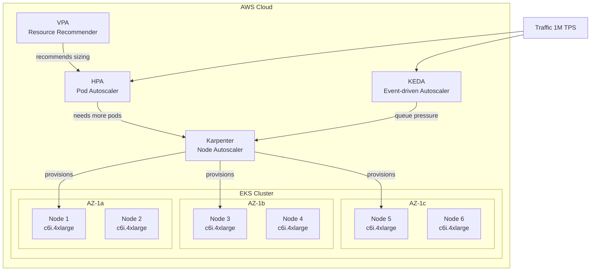
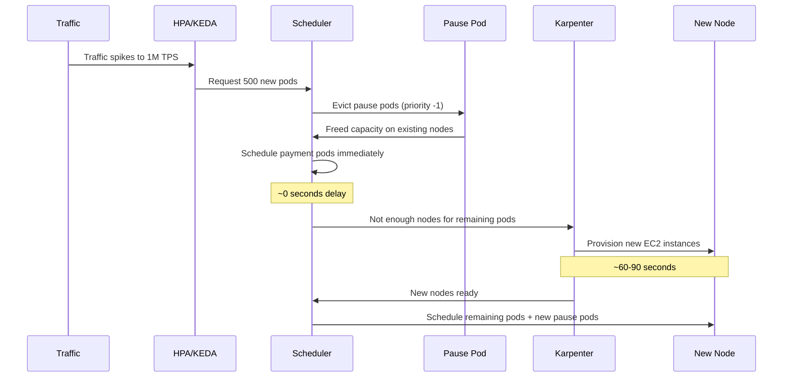
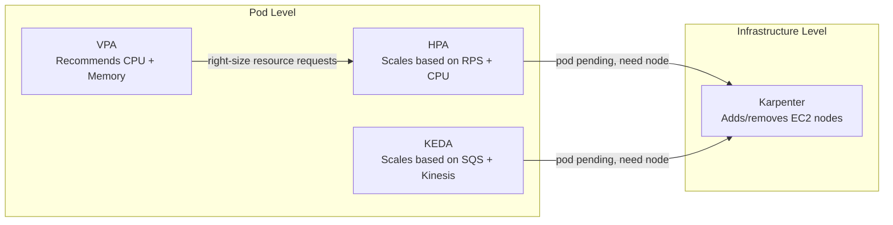
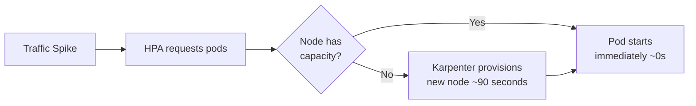
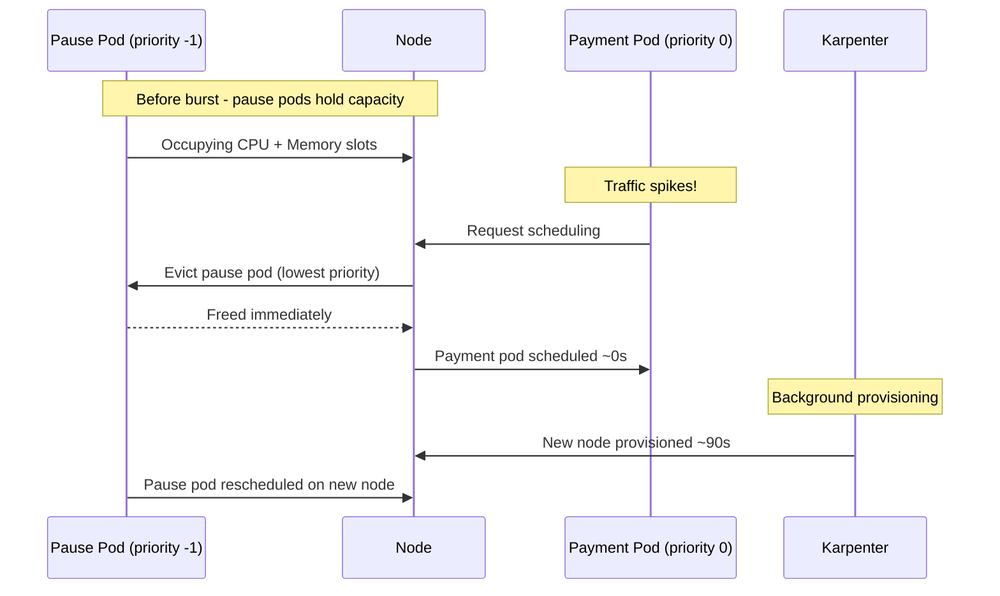
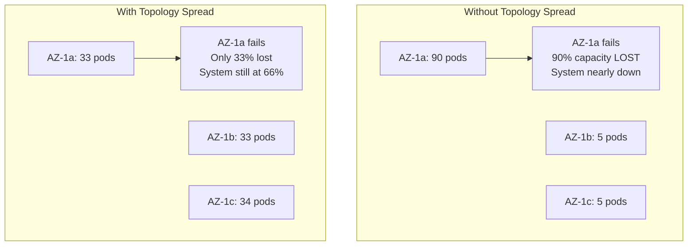
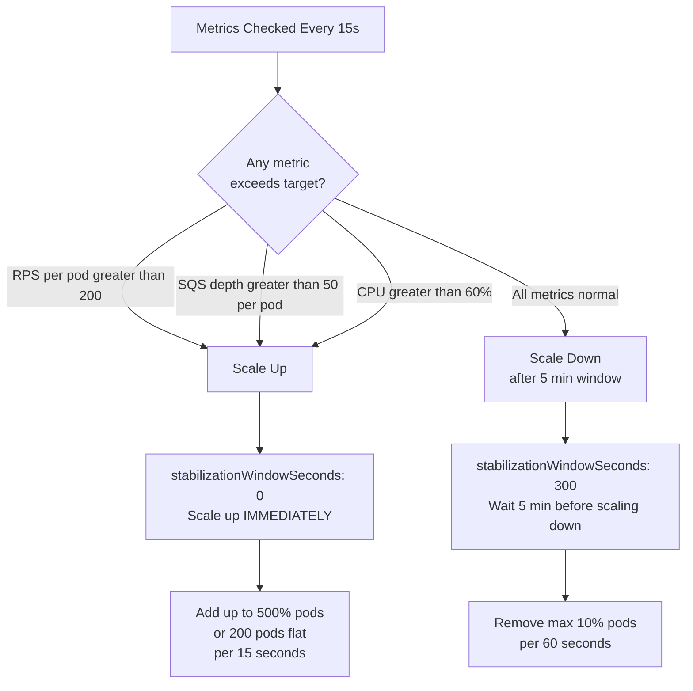

# Section A: Cluster Architecture & Auto-Scaling

## Overview

This section describes the EKS cluster design to handle traffic
spikes from 1 TPS to 1,000,000 TPS within seconds.

The strategy is built on three layers:

1. **Pre-warming** — reserve capacity before the event using pause pods
2. **Reactive scaling** — Karpenter + HPA/KEDA absorb the burst as it lands
3. **Topology resilience** — spread constraints ensure AZ balance during chaos

---

## 1. Overall Architecture Diagram



---

## 2. Scaling Flow Diagram



---

## 3. Auto-Scaling Strategy

### Why use all four autoscalers?

Each autoscaler operates at a **different level** and they
do not conflict with each other:



| Component | Level | Reacts To | Action |
|-----------|-------|-----------|--------|
| Karpenter | Node | Pending pods | Add/remove EC2 instances |
| HPA | Pod | RPS, CPU, queue depth | Add/remove pod replicas |
| KEDA | Pod | SQS depth, Kinesis lag | Add/remove consumer pods |
| VPA | Pod | Historical usage | Recommend resource sizing |

---

## 4. Pre-Warming Strategy

### The Cold-Start Problem



**Without pre-warming:** 60-90 second delay before new pods start.
**With pause pods:** new payment pods start in ~0 seconds.

### How Pause Pods Work



### Pause Pod Priority

```
PriorityClass values:
─────────────────────────────────────────────
System pods          : 2000000000  (highest)
Real workloads       : 0           (default)
Pause pods           : -1          (lowest)
─────────────────────────────────────────────

Eviction order (lowest priority evicted first):
Pause pods → Real workloads → System pods
```

---

## 5. AZ Spread Strategy

### Why spread across AZs?



### Constraints Applied

| Constraint | Type | Rule |
|------------|------|------|
| AZ spread | Hard (DoNotSchedule) | maxSkew: 1 between AZs |
| Node spread | Soft (ScheduleAnyway) | maxSkew: 2 between nodes |

---

## 6. Instance Selection Rationale

### Why compute-optimized (c6i/c6a)?

Payment processing is **CPU-bound**:
- TLS encryption/decryption
- JWT token validation
- JSON serialization/deserialization
- Business rule validation

| Instance | Type | vCPU | Memory | Price/hr | Verdict |
|----------|------|------|--------|----------|---------|
| c6i.2xlarge | Compute-optimized | 8 | 16GB | ~$0.34 | ✅ Best choice |
| m6i.2xlarge | General-purpose | 8 | 32GB | ~$0.48 | Fallback |
| r6i.2xlarge | Memory-optimized | 8 | 64GB | ~$0.50 | Not needed |

**c6i wins** on price/performance for CPU-bound payment workloads.

### Spot vs On-Demand Mix

```
┌─────────────────────────────────────────────┐
│            Node Fleet Strategy              │
├───────────────────┬─────────────────────────┤
│    Spot (70%)     │     On-Demand (30%)     │
├───────────────────┼─────────────────────────┤
│ ~70% cheaper      │ Full price              │
│ Can be reclaimed  │ Always available        │
│ by AWS anytime    │ Guaranteed uptime       │
├───────────────────┼─────────────────────────┤
│ Handles burst     │ Handles baseline        │
│ traffic           │ traffic + SLA guarantee │
└───────────────────┴─────────────────────────┘
```

---

## 7. HPA Scaling Behavior



---

## 8. Key Design Decisions

### Decision 1: stabilizationWindowSeconds 0 on scaleUp

**Problem:** Default HPA stabilization window is 3 minutes.
For a viral traffic spike, 3 minutes of delay means thousands
of failed payment transactions.

**Solution:** Set to 0 — HPA reacts immediately with no delay.

---

### Decision 2: VPA mode Off

**Problem:** VPA in Auto mode restarts pods to resize resources.
For a payment service, unexpected pod restarts = dropped transactions.

**Solution:** Use Off mode — VPA only generates recommendations.
We review and apply them manually during maintenance windows.

**How VPA and HPA coexist without conflict:**

```
VPA (Off mode)                    HPA
──────────────────                ──────────────────────────
Observes pod resource   ───────►  Scales pod COUNT based on
usage over time                   accurate resource REQUESTS
                                  set from VPA recommendations

No conflict because VPA never mutates live pods.
```

---

### Decision 3: PDB minAvailable 70%

**Problem:** During node upgrades or Karpenter consolidation,
Kubernetes may evict too many pods at once — causing an outage.

**Solution:** PDB enforces that at least 70% of pods must stay up.
Even during maintenance, the system handles at least 700K TPS.

---

### Decision 4: 20 Pause Pod Replicas

**Calculation:**

```
20 pause pods × 1 CPU    = 20 CPU reserved
20 pause pods × 2Gi RAM  = 40Gi RAM reserved

c6i.4xlarge = 16 vCPU, 32Gi RAM per node
20 pause pods ≈ 4-5 nodes worth of pre-warmed capacity

This covers the first wave of burst traffic instantly
while Karpenter provisions additional nodes in the background.
```

---

## 9. Manifest Files Summary

| File | Kind | Purpose |
|------|------|---------|
| `karpenter-nodepool.yaml` | NodePool + EC2NodeClass | Node provisioning rules and EC2 config |
| `hpa.yaml` | HorizontalPodAutoscaler | Scale pods based on RPS and CPU |
| `keda-scaledobject.yaml` | ScaledObject | Scale pods based on SQS and Kinesis |
| `vpa.yaml` | VerticalPodAutoscaler | Resource sizing recommendations only |
| `topology-spread.yaml` | Deployment | AZ-balanced pod scheduling |
| `pdb.yaml` | PodDisruptionBudget | Minimum availability protection |
| `pause-pod.yaml` | Deployment + PriorityClass | Capacity pre-warming via placeholder pods |
