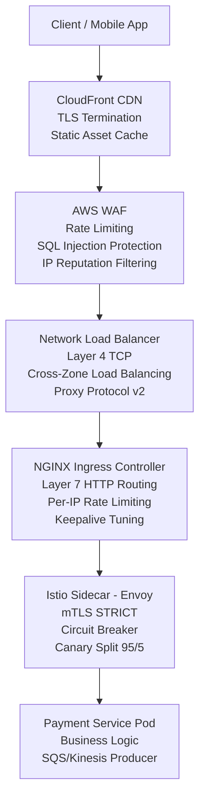
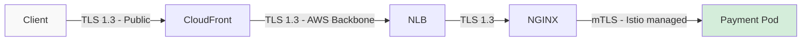
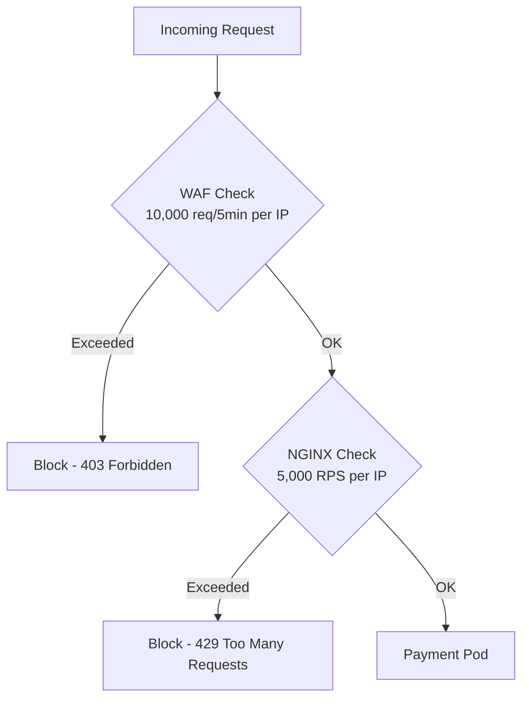
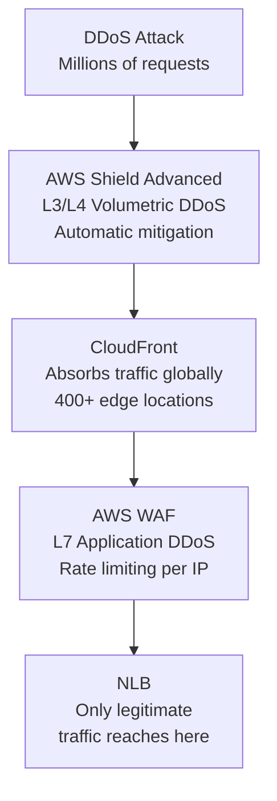
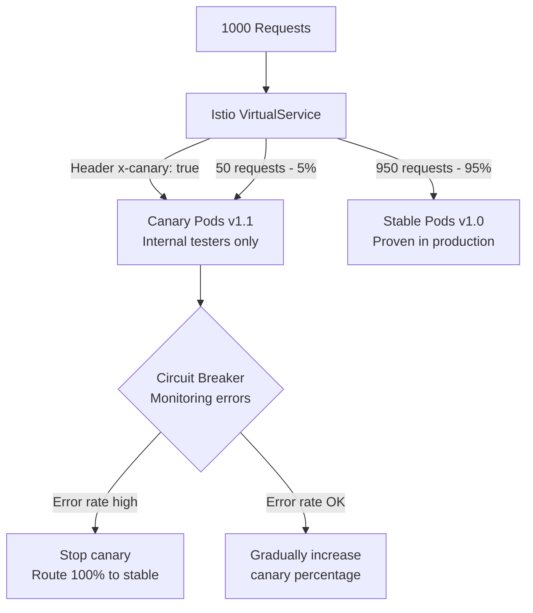
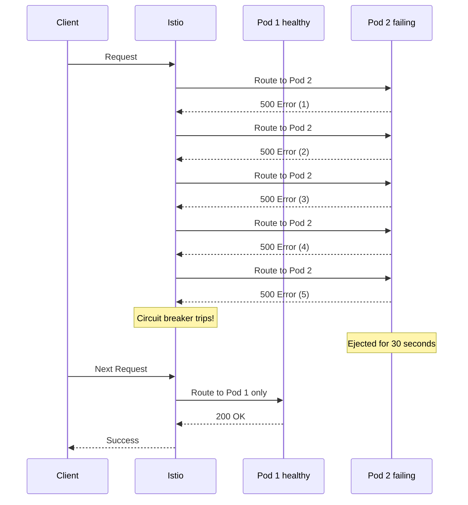
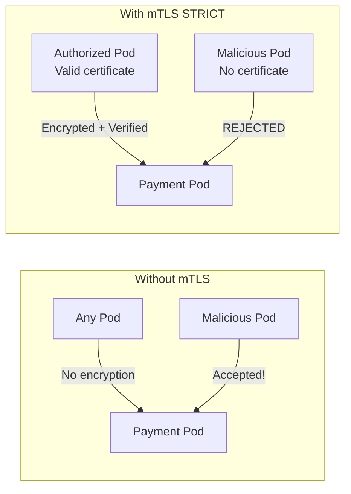
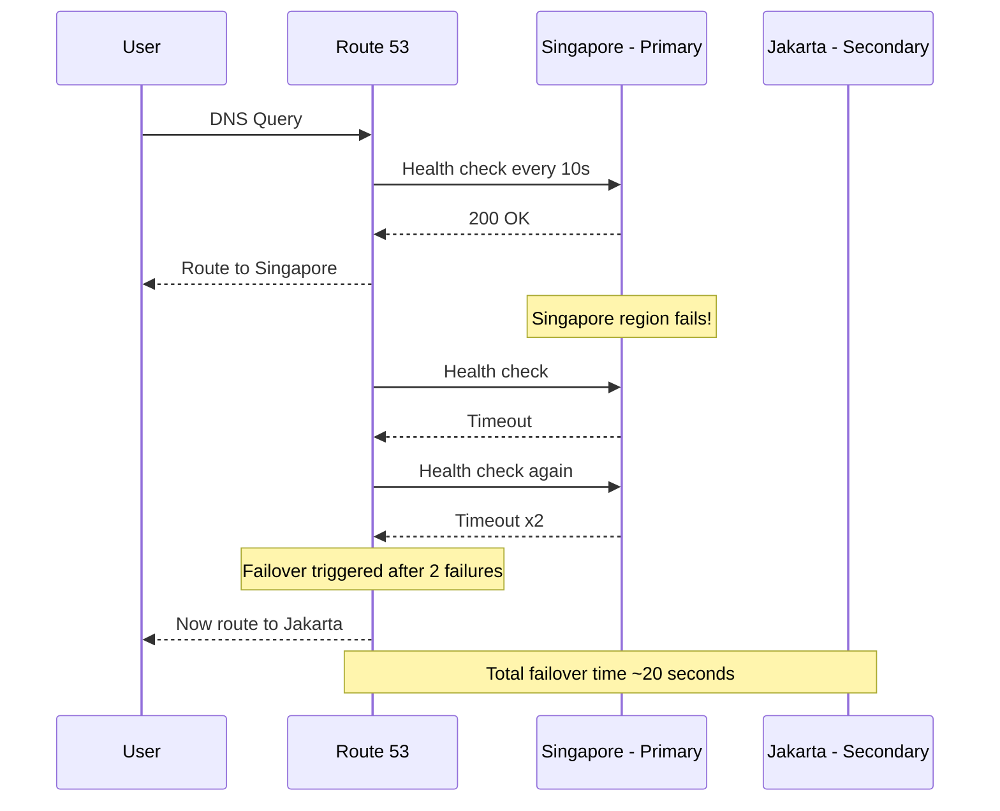

# Section B: Networking & Traffic Management

## Overview

This section describes the full request path from client to pod,
covering TLS termination, rate limiting, DDoS protection,
canary deployments, and circuit breaking at 1M TPS.

---

## 1. Full Request Path

### What sits at each layer and why?

| Layer | Component | Responsibility |
|-------|-----------|----------------|
| DNS | Route 53 | Latency-based routing, health check failover |
| CDN | CloudFront | TLS termination, static cache, DDoS absorption |
| Firewall | AWS WAF | Rate limiting, SQLi, IP reputation |
| L4 LB | NLB | TCP load balancing, static IPs, Proxy Protocol |
| L7 LB | NGINX Ingress | HTTP routing, per-IP rate limit, keepalive |
| Service Mesh | Istio Sidecar | mTLS, circuit breaker, canary split |
| App | Payment Pod | Business logic, payment processing |

---

## 2. TLS Termination

- **CloudFront:** Terminates public TLS — offloads handshake from origin
- **NLB → NGINX:** Re-encrypted using TLS 1.3 only
- **NGINX → Pod:** mTLS enforced by Istio sidecar automatically
- **Certificate rotation:** Istio rotates pod certificates every 24 hours

---

## 3. Rate Limiting Strategy

Rate limiting is applied at two layers:

| Layer | Limit | Action | Purpose |
|-------|-------|--------|---------|
| WAF | 10,000 req / 5 min per IP | Block 403 | Stop DDoS, brute force |
| NGINX | 5,000 RPS per IP | Return 429 | Fine-grained API protection |

---

## 4. DDoS Protection

Three layers of DDoS protection:
1. **AWS Shield Advanced** — absorbs volumetric L3/L4 attacks automatically
2. **CloudFront** — distributes traffic across 400+ edge locations globally
3. **AWS WAF** — blocks L7 application-level attacks and abusive IPs

---

## 5. Canary Deployment During Spike

**Why canary during 1M TPS event?**
- Even during peak traffic, hotfixes may need to be deployed
- Canary limits blast radius — only 5% users affected if new version has bugs
- Circuit breaker automatically stops canary if error rate spikes
- Header-based routing allows internal team to test without affecting real users

---

## 6. Circuit Breaking

Circuit breaker configuration:
- **Threshold:** 5 consecutive 5xx errors
- **Eject duration:** 30 seconds (doubles on repeat failures)
- **Max ejection:** 50% of pod pool (system never fully goes down)
- **Recovery:** Single test request after eject period ends

---

## 7. mTLS Between Services

- **Mode: STRICT** — all pod-to-pod traffic must use mTLS
- **Zero code changes** — Istio sidecar handles everything automatically
- **Certificate rotation** — every 24 hours, no manual intervention needed

---

## 8. NLB Key Configurations

| Annotation | Value | Why |
|------------|-------|-----|
| nlb-target-type | ip | Direct pod routing, avoids node hop |
| cross-zone-load-balancing | true | Even distribution across AZs |
| proxy-protocol | * | Preserves real client IP for fraud detection |
| connection-draining-timeout | 30s | Allows in-flight payments to complete |
| externalTrafficPolicy | Local | Avoids double network hop |

---

## 9. NGINX Key Tuning Parameters

| Parameter | Value | Why |
|-----------|-------|-----|
| worker-connections | 65535 | Max concurrent connections per worker |
| keep-alive-requests | 10000 | Reuse connections — avoid TCP handshake overhead |
| upstream-keepalive-connections | 1000 | Reuse connections to upstream pods |
| ssl-protocols | TLSv1.3 | Fastest and most secure TLS version |
| ssl-session-cache-size | 100m | Cache TLS sessions — save 80% CPU on handshakes |
| access-log-path | /dev/null | Prevent disk I/O bottleneck at 1M TPS |

---

## 10. Route 53 Failover Flow

---

## 11. Manifest Files Summary

| File | Type | Purpose |
|------|------|---------|
| `service-nlb.yaml` | Kubernetes Service | Expose payment service via NLB |
| `nginx-configmap.yaml` | ConfigMap + Ingress | NGINX tuning and routing rules |
| `istio-virtualservice.yaml` | Istio VirtualService | Canary traffic split 95/5 |
| `istio-destinationrule.yaml` | Istio DestinationRule | Circuit breaker and connection pool |
| `istio-peerauthentication.yaml` | Istio PeerAuthentication | mTLS STRICT for all pod communication |
| `waf-rules.tf` | Terraform | WAF rules and CloudFront config |
| `route53.tf` | Terraform | DNS routing and health checks |

---

## 12. Key Design Decisions

### Decision 1: NLB over ALB
NLB operates at Layer 4 (TCP) — much faster than ALB (Layer 7).
At 1M TPS, NLB handles millions of connections per second with
minimal latency. HTTP routing is handled by NGINX instead.

### Decision 2: Two layers of rate limiting
WAF handles volumetric attacks (10K req/5min per IP).
NGINX handles fine-grained API abuse (5K RPS per IP).
Two layers ensure no single point of bypass.

### Decision 3: Canary at 5% during spike
Small enough to limit blast radius if new version has issues.
Large enough to get statistically significant error data.
Circuit breaker automatically stops canary if errors spike.

### Decision 4: mTLS STRICT mode
Payment data is highly sensitive — all pod communication
must be encrypted and authenticated.
STRICT mode ensures zero unencrypted traffic within the cluster.
