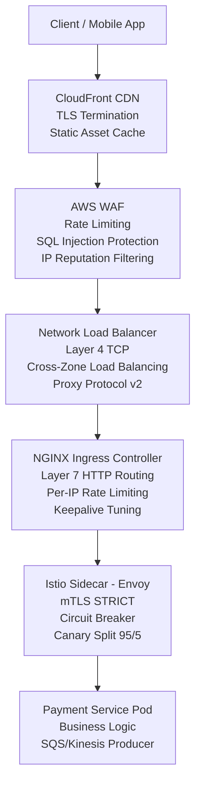
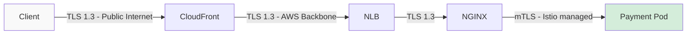
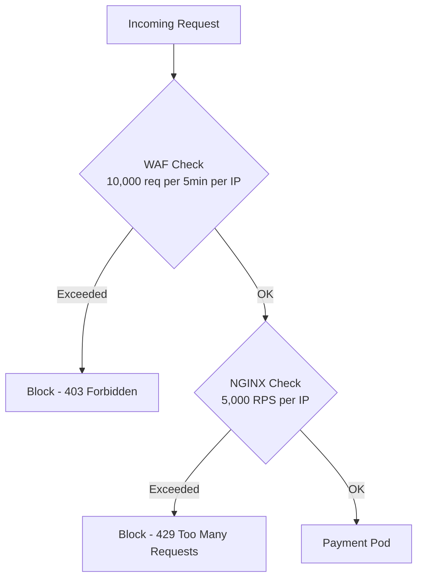
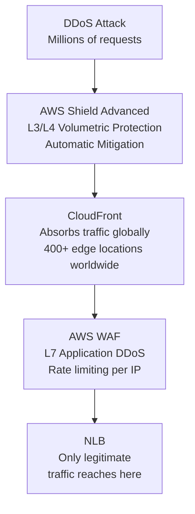
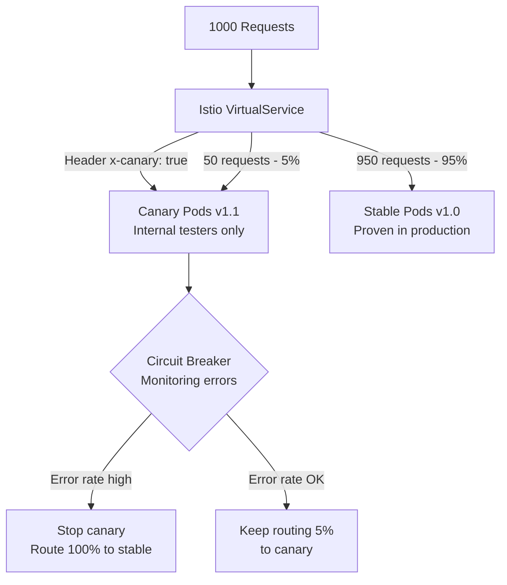
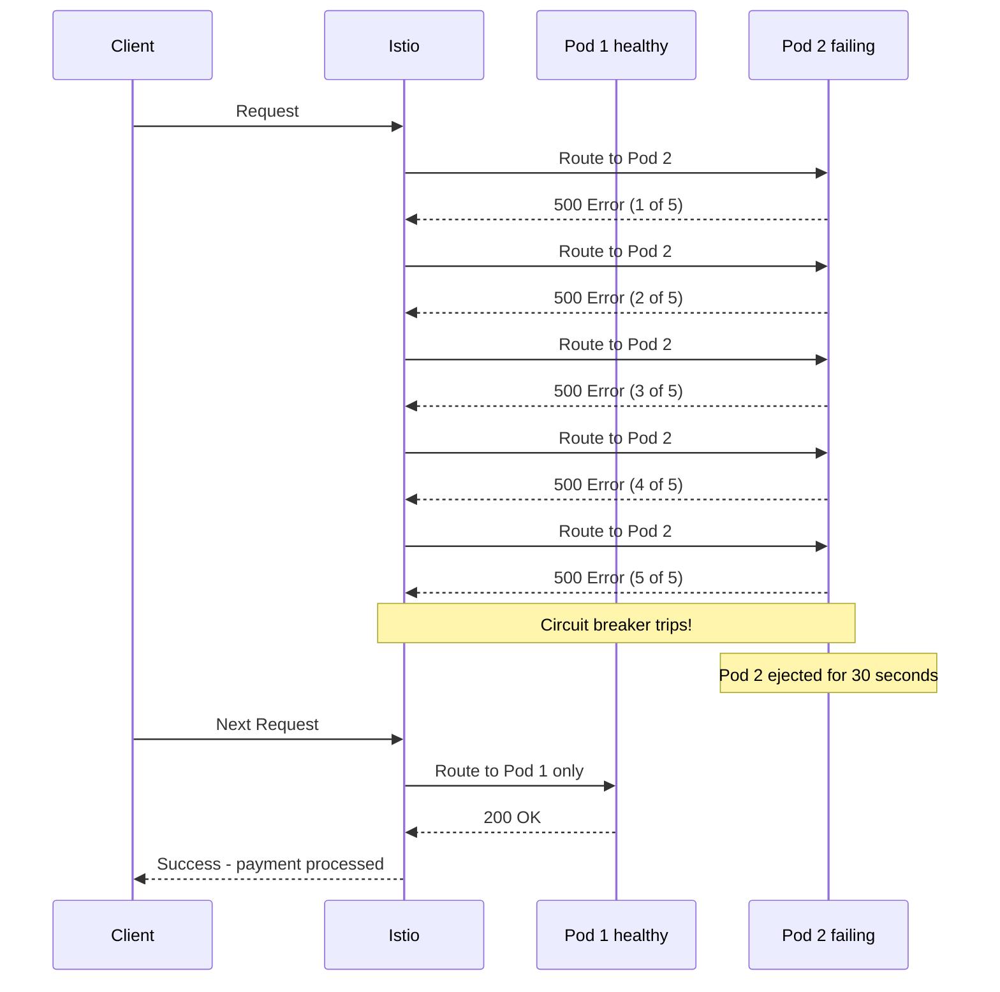
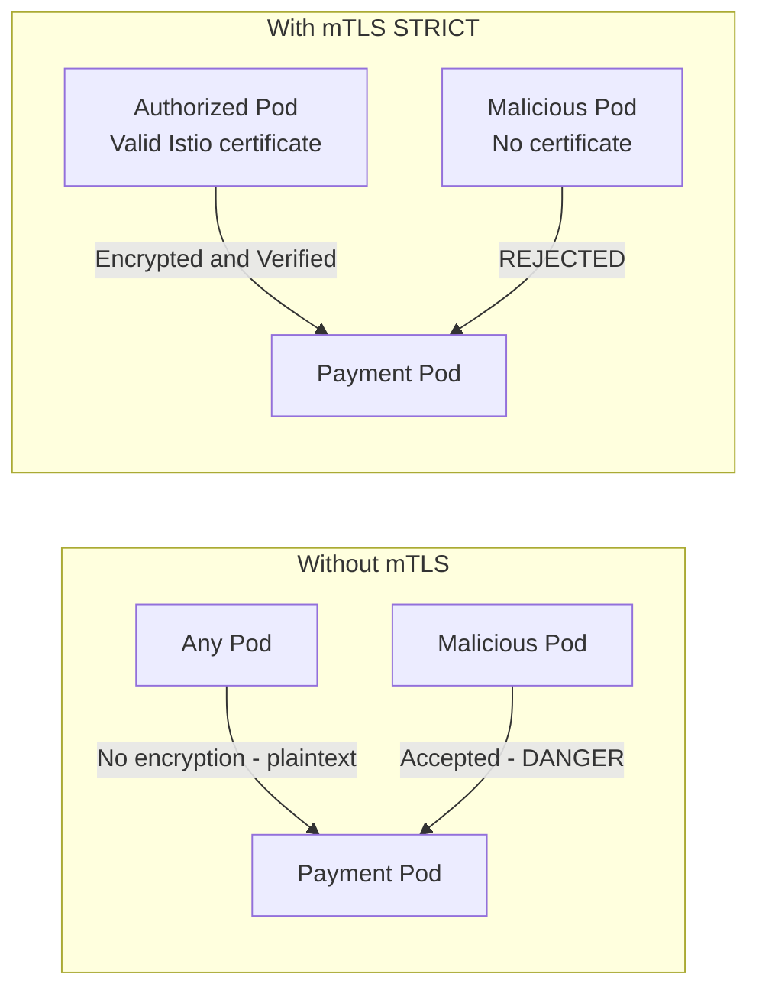
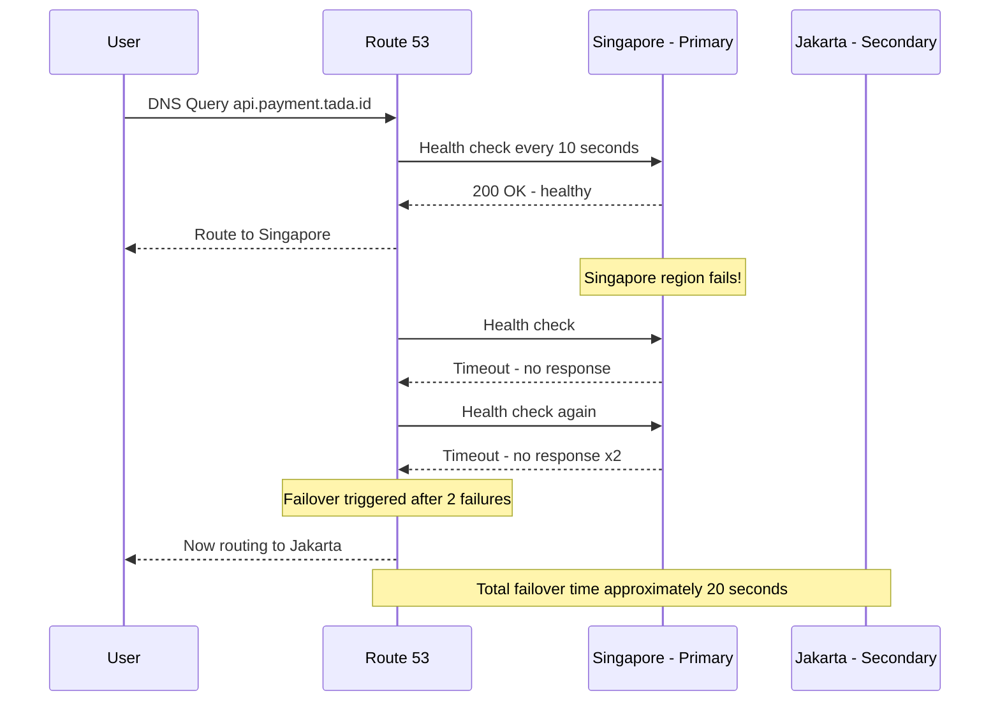
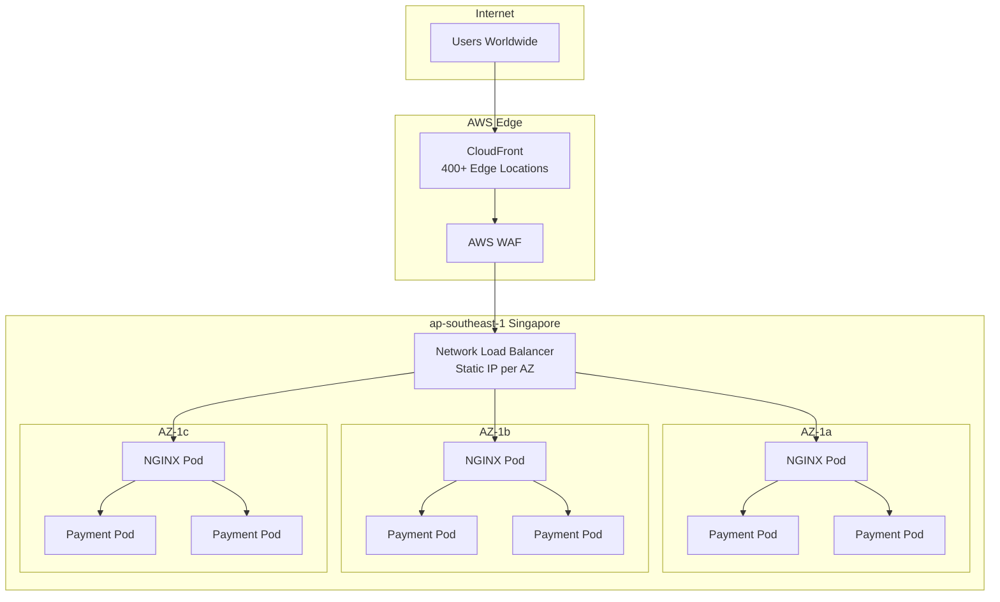

# Section B: Network Architecture Diagrams

## 1. Full Request Path

---

## 2. TLS Termination Points

---

## 3. Rate Limiting Flow

---

## 4. DDoS Protection Layers

---

## 5. Canary Deployment Flow

---

## 6. Circuit Breaker Flow

---

## 7. mTLS Between Services

---

## 8. Route 53 Failover Flow

---

## 9. Multi-AZ Network Distribution

