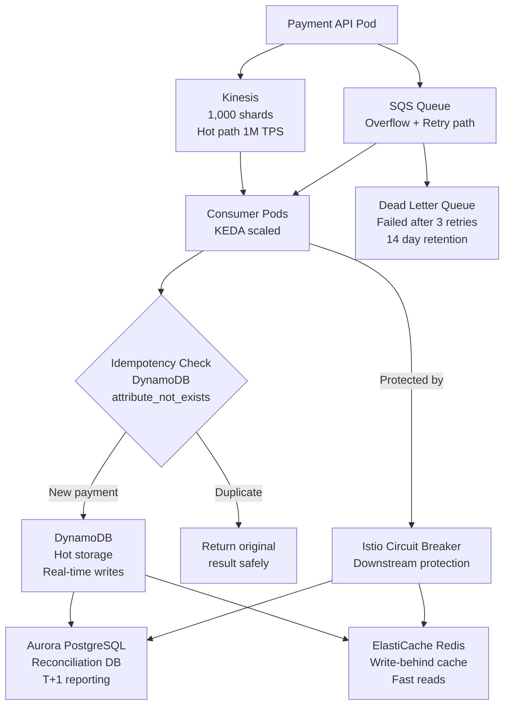
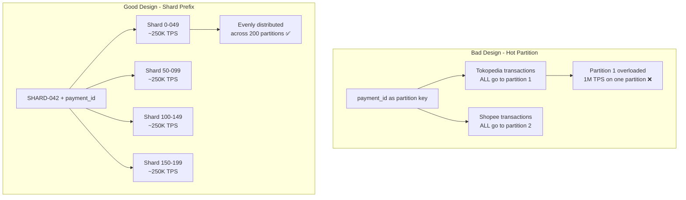
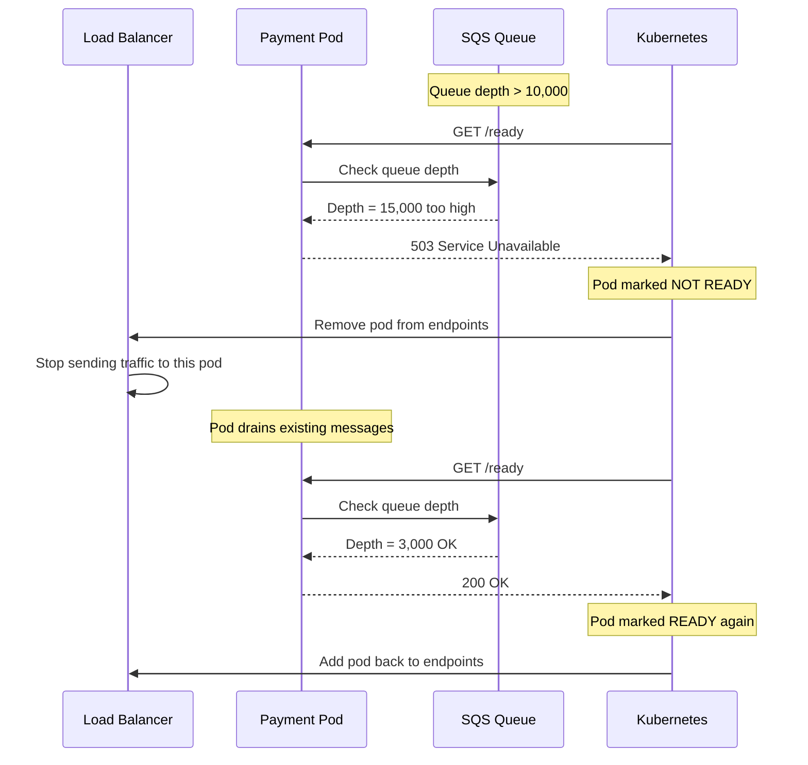
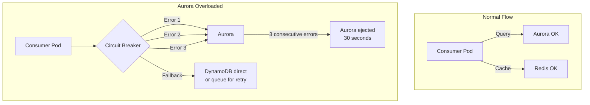
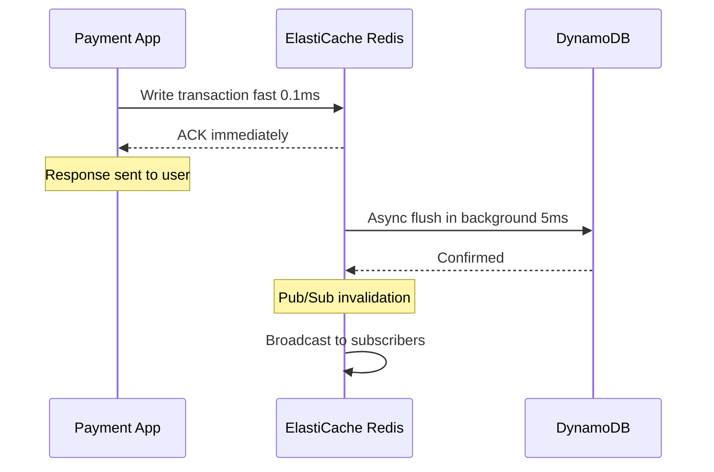
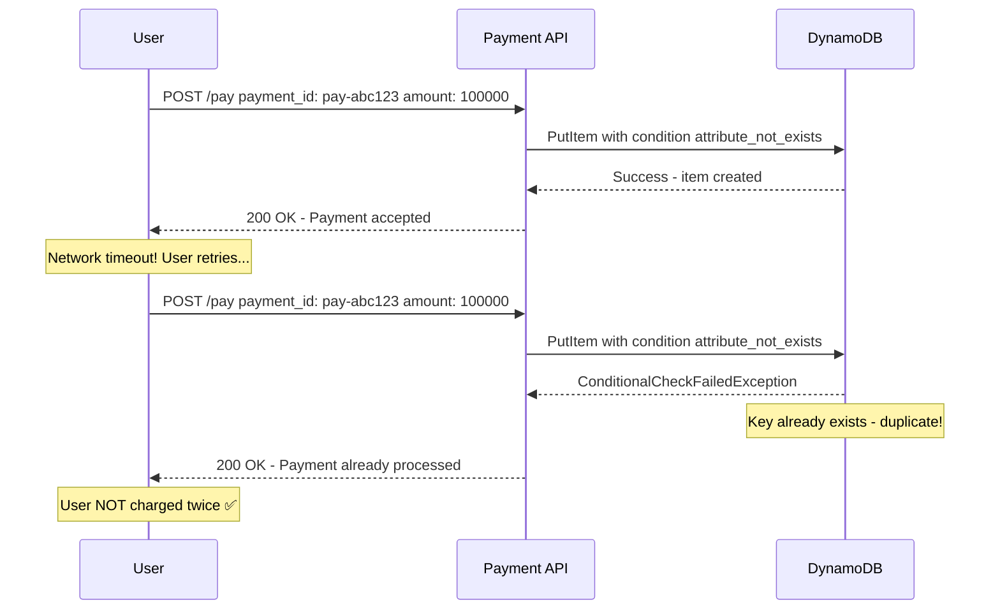
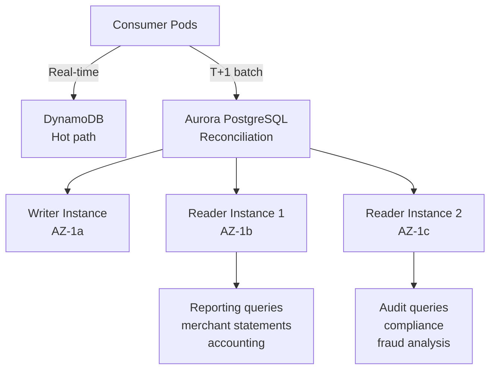

# Section C: Data Layer & Backpressure

## Overview

This section describes how the system ingests 1M TPS with zero
transaction loss, what database and caching strategy handles
this write volume, and how backpressure is applied when
downstream services are saturated.

---

## 1. Data Flow Architecture



---

## 2. Kinesis Shard Calculation

### Math

```
Target throughput : 1,000,000 TPS
Average payload   : 1 KB per transaction

Gross data rate:
1,000,000 TPS x 1 KB = 1,000,000 KB/s
                      = 1,000 MB/s
                      = ~1 GB/s

Kinesis limits per shard:
Write : 1 MB/s OR 1,000 records/s (whichever is hit first)
Read  : 2 MB/s standard
Read  : 2 MB/s per consumer (Enhanced Fan-Out)

Shards required for writes:
1,000 MB/s / 1 MB/s per shard = 1,000 shards

Enhanced Fan-Out consumers:
5 consumer groups x 1,000 shards x 2 MB/s = 10 GB/s egress
```

### Why PROVISIONED and not ON-DEMAND?

```
On-Demand mode:
Flexible but has 30 min warm-up for 2x previous peak

Example problem:
Normal traffic  : 1,000 TPS
Sudden spike    : 1,000,000 TPS
On-Demand       : needs 30 min to scale shards
During 30 min   : transactions throttled and dropped ❌

Provisioned mode (what we use):
Pre-set to 1,000 shards from the start
Ready from second zero ✅
```

---

## 3. DynamoDB Schema Design

### Table: payment_events

| Key | Attribute | Format | Example |
|-----|-----------|--------|---------|
| Partition Key | shard_id | SHARD-{0-199}#{uuid_prefix} | SHARD-042#pay-abc1 |
| Sort Key | event_id | {timestamp_ms}#{uuid} | 1712345678#pay-abc123 |
| - | idempotency_key | IDEM#{payment_id} | IDEM#pay-abc123 |
| - | merchant_id | String | merchant-001 |
| - | status | String | PENDING |
| - | created_at | Number (Unix) | 1712345678 |
| - | expires_at | Number (Unix TTL) | 1714937678 |

### GSI (Global Secondary Index)

| Index | Hash Key | Range Key | Use Case |
|-------|----------|-----------|----------|
| merchant-index | merchant_id | created_at | Query all transactions per merchant |
| status-index | status | created_at | Query PENDING transactions for reconciliation |

### Hot Partition Strategy



### On-Demand vs Provisioned Trade-Off

| | On-Demand | Provisioned |
|--|-----------|-------------|
| Scaling | Automatic | Manual pre-set |
| Warm-up | 30 min for 2x spike | None - ready immediately |
| Cost at peak | Higher | Lower (pre-negotiated) |
| Cost at idle | Lower | Higher (paying for reserved) |
| Best for | Unpredictable traffic | Known spike events |
| Our choice | ❌ | ✅ Pre-set 1.2M WCU |

---

## 4. Backpressure Implementation



### Three Backpressure Mechanisms

```
1. Readiness Probe
   Pod /ready returns 503 when queue > 10,000
   Kubernetes removes pod from load balancer
   No new traffic until queue drains

2. SQS DLQ (Dead Letter Queue)
   Message fails 3 times moves to DLQ
   Stops retrying failing messages
   Prevents queue from filling with bad messages

3. Istio Circuit Breaker on Downstream Calls
   Consumer pod to Aurora/Redis errors 3-5 times
   Istio ejects downstream service temporarily
   Prevents cascading failures to database layer
```

---

## 5. Istio Circuit Breaker for Downstream Calls



### Aurora vs Redis Circuit Breaker Settings

| Setting | Aurora | Redis |
|---------|--------|-------|
| Error threshold | 3 errors | 5 errors |
| Check interval | 10s | 5s |
| Eject duration | 30s | 15s |
| Max eject % | 50% | 33% |
| Reason | Slower, more sensitive | Fast, more tolerant |

### Why Different Settings?

```
Aurora PostgreSQL:
- Slower responses (~5ms per query)
- Limited max connections (~5,000)
- Trip faster (3 errors) — problems are serious
- Recover slower (30s) — needs time to stabilize

Redis:
- Very fast responses (~0.1ms)
- Handles millions of connections
- Trip slower (5 errors) — brief errors are normal
- Recover faster (15s) — usually quick to recover
```

---

## 6. ElastiCache Redis - Write-Behind Pattern



### Cluster Mode Structure

```
Redis Cluster (3 shards x 2 replicas):

AZ-1a:                    AZ-1b:                    AZ-1c:
Shard 1 Primary           Shard 2 Primary           Shard 3 Primary
~333K TPS                 ~333K TPS                 ~333K TPS
    |                         |                         |
Shard 1 Replica           Shard 2 Replica           Shard 3 Replica
(backup)                  (backup)                  (backup)

Total: ~1M TPS capacity

If Primary fails - Replica promoted in ~30 seconds
If AZ fails      - Other AZs continue serving
```

### Why Write-Behind?

```
Without Redis (direct to DynamoDB):
Request - DynamoDB - Response
           ~5ms wait
           $780/hr for 1.2M WCU

With Redis (write-behind):
Request - Redis - Response fast ~0.1ms
              - async
          DynamoDB (background, no user waiting)

Benefits:
- Response 50x faster for users
- DynamoDB write pressure reduced ~80%
- Cost savings on DynamoDB WCU
```

---

## 7. Idempotency - Exactly-Once Processing



### Why attribute_not_exists?

```
Normal INSERT:
Insert this record
If record exists - overwrites it
Dangerous for payments!

Conditional INSERT (what we use):
Insert ONLY IF this key does not exist
If record exists - throws exception
We catch exception - return original result
User never charged twice ✅

This operation is ATOMIC in DynamoDB:
Check + Insert happen in one operation
No race condition even at 1M TPS
```

---

## 8. Aurora - Reconciliation Database



### DynamoDB vs Aurora - Role Separation

| | DynamoDB | Aurora PostgreSQL |
|--|----------|------------------|
| Role | Hot path real-time | Reconciliation T+1 |
| Write speed | ~1ms | ~5ms |
| Max TPS | Unlimited | ~50,000 |
| Complex queries | Limited | Full SQL ✅ |
| Joins | ❌ | ✅ |
| Reporting | Difficult | Easy ✅ |
| In critical path | ✅ Yes | ❌ No |

Aurora is NOT in the critical payment path.
It receives data AFTER DynamoDB confirms the transaction.
Aurora slowness never affects payment processing speed.

---

## 9. Manifest Files Summary

| File | Type | Purpose |
|------|------|---------|
| `kinesis.tf` | Terraform | Kinesis stream with 1,000 shards |
| `dynamodb.tf` | Terraform | DynamoDB table with shard prefix design |
| `aurora.tf` | Terraform | Aurora PostgreSQL for reconciliation |
| `elasticache.tf` | Terraform | Redis cluster mode write-behind cache |
| `sqs.tf` | Terraform | SQS queue with DLQ and redrive policy |
| `backpressure.yaml` | Kubernetes | Readiness probe and lifecycle hooks |
| `idempotency.py` | Python | Exactly-once payment processing |
| `istio-downstream-circuit-breaker.yaml` | Istio | Circuit breaker for Aurora and Redis calls |

---

## 10. Key Design Decisions

### Decision 1: Kinesis over SQS for hot path
SQS max throughput is ~3,000 msg/sec per queue.
Kinesis scales to 1M TPS with 1,000 shards.
SQS is used alongside Kinesis for retry and DLQ support.

### Decision 2: DynamoDB shard prefix (0-199)
Using payment_id directly as partition key creates hot partitions
for popular merchants (e.g. Tokopedia gets millions of transactions).
Random shard prefix distributes writes evenly across 200 partitions.

### Decision 3: Redis write-behind over write-through
Write-through: write to Redis AND DynamoDB synchronously.
Write-behind: write to Redis only, flush to DynamoDB async.
Write-behind is 50x faster for users and reduces DynamoDB cost by 80%.

### Decision 4: Aurora only for reconciliation
Aurora handles complex SQL queries for reporting and accounting.
It is not in the critical payment path — DynamoDB handles real-time.
This separation means Aurora slowness never affects payment speed.

### Decision 5: Separate circuit breakers for each downstream
Aurora and Redis have different performance characteristics.
Aurora trips faster (3 errors) and recovers slower (30s).
Redis trips slower (5 errors) and recovers faster (15s).
Separate settings prevent false positives and unnecessary ejections.
