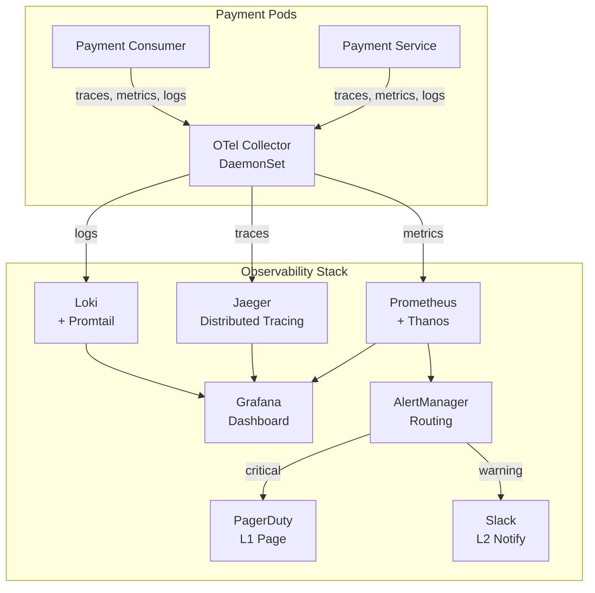
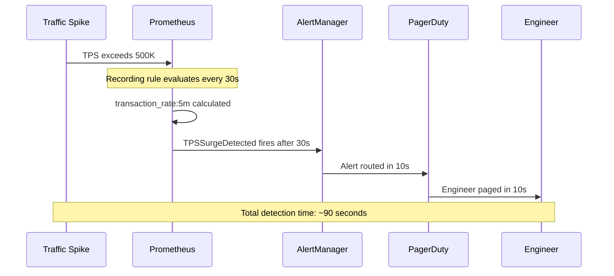
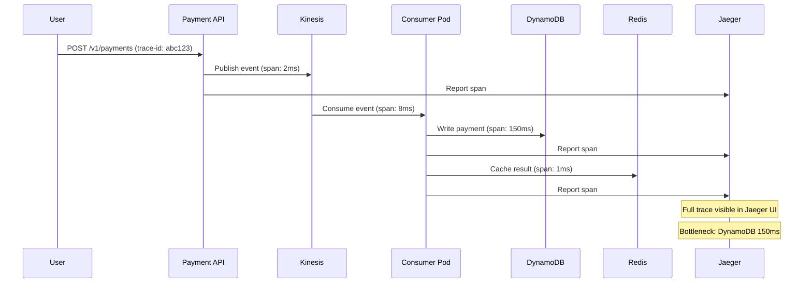
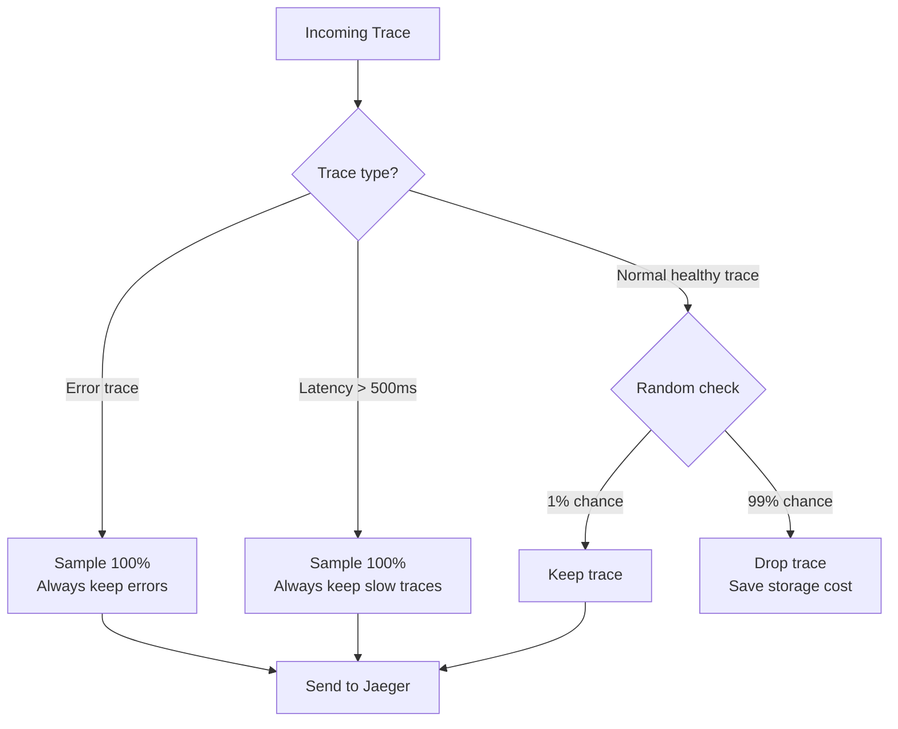
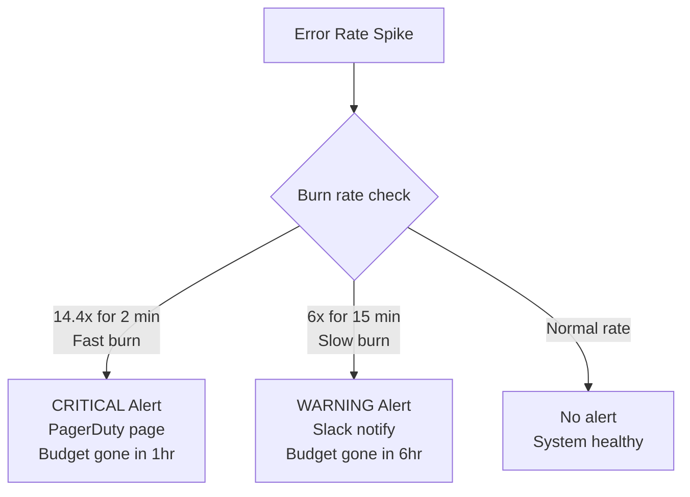
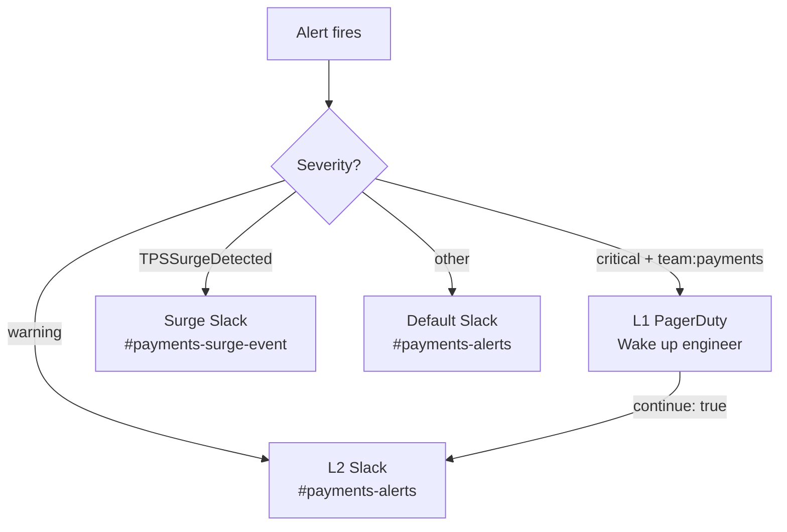

# Section D: Observability & Incident Response

## Overview

This section describes the monitoring and alerting stack,
how fast it can detect traffic surges, how to trace a single
transaction across the entire pipeline, and the incident
response runbook for the 1M TPS event.

---

## 1. Observability Stack Architecture



---

## 2. How Fast Can It Detect a Surge?



### Detection Timeline

| Event | Time |
|-------|------|
| Traffic spike starts | 0s |
| Prometheus recording rule evaluates | 30s |
| Alert condition confirmed (for: 30s) | 60s |
| AlertManager routes alert | 70s |
| PagerDuty pages engineer | 80s |
| Engineer acknowledges | ~120s |

**Total time from spike to engineer notified: ~90 seconds**

---

## 3. Full Observability Stack

| Component | Purpose | Storage |
|-----------|---------|---------|
| OTel Collector | Collect + process telemetry | None (pipe only) |
| Prometheus | Store metrics | Local 2h + S3 via Thanos |
| Thanos | Long-term metrics storage | S3 |
| Grafana | Visualize metrics + traces + logs | None (queries others) |
| Jaeger | Store + visualize traces | Elasticsearch |
| Loki | Store + search logs | S3 |
| AlertManager | Route alerts | None |
| Promtail | Collect pod logs | None (pipe only) |

---

## 4. Distributed Tracing — Single Transaction



### How to Trace One Transaction in Jaeger

```
1. Open Jaeger UI: http://jaeger.tada.id/jaeger

2. Search by payment_id:
   Service: payment-service
   Tags: payment_id=pay-abc123

3. Click on the trace result

4. See full timeline:
   payment-api      [==] 5ms
   kinesis          [=] 2ms
   payment-consumer [===] 8ms
     dynamodb-write [========================] 150ms ← bottleneck
     redis-cache    [=] 1ms
   aurora           [==] 3ms

5. Click on any span to see:
   - Exact error message
   - Stack trace
   - Request/response details
   - Tags and metadata
```

---

## 5. Adaptive Sampling Strategy



### Why Adaptive Sampling?

```
Without sampling (keep all traces):
1,000,000 TPS = 1,000,000 traces/second
= 86,400,000,000 traces/day
= storage cost explodes ❌

With adaptive sampling:
Normal traces  : keep 1%    = 10,000 traces/sec
Error traces   : keep 100%  = never miss an error
Slow traces    : keep 100%  = never miss a bottleneck

Storage reduced by 99% while keeping all important data ✅
```

---

## 6. Prometheus SLO Rules

### Multi-Window Burn Rate Explained

```
SLO Target: 99.9% availability
Error budget: 0.1% per month = 43.8 minutes downtime allowed

Burn rate = how fast we consume the error budget

Burn rate 1x  = normal, budget exhausted in 30 days
Burn rate 14.4x = budget exhausted in 50 hours → PAGE NOW
Burn rate 6x  = budget exhausted in 5 days  → WARN SLACK
```



---

## 7. Grafana Dashboard Panels

| Panel | Type | Purpose | Alert Threshold |
|-------|------|---------|----------------|
| Real-Time TPS | Stat | Current TPS with color coding | Yellow: 500K, Red: 900K |
| Error Rate % | Stat | Failed transaction percentage | Yellow: 0.1%, Red: 1% |
| HPA Replica Count | Stat | Current pod count | Red if below 10 |
| SLO Budget Remaining | Gauge | Monthly error budget left | Red if below 50% |
| Latency p50/p95/p99 | Timeseries | Request latency trends | Red line at 500ms |
| Error Rate by Service | Timeseries | Per-service error breakdown | Visual only |
| Kinesis Consumer Lag | Timeseries | How far behind consumers are | Red line at 30s |
| DynamoDB WCU Consumed | Timeseries | Write capacity vs limit | Red line at 1.2M |
| Node CPU Heatmap | Heatmap | CPU usage per node | Visual hotspot detection |
| SQS Queue Depth | Timeseries | Messages waiting + DLQ depth | Red line at 10K |

---

## 8. AlertManager Routing Tree



### Inhibition Rules

```
Without inhibition:
1 pod crash →
  PodCrash (critical) fires
  HighLatency (warning) fires
  LowThroughput (warning) fires
  ErrorRateHigh (warning) fires
= 4 alerts, 1 root cause ← noisy!

With inhibition:
1 pod crash →
  PodCrash (critical) fires
  All related warnings SUPPRESSED
= 1 alert, 1 root cause ← clean! ✅
```

---

## 9. Manifest Files Summary

| File | Purpose |
|------|---------|
| `prometheus-rules.yaml` | SLO recording rules and alerting rules |
| `alertmanager-config.yaml` | Alert routing to PagerDuty and Slack |
| `otel-collector.yaml` | Telemetry collection with adaptive sampling |
| `jaeger.yaml` | Distributed tracing storage and UI |
| `loki.yaml` | Log aggregation with Promtail collector |
| `grafana-dashboard.json` | Real-time dashboard with 10 panels |
| `runbook.md` | Pre-event checklist and incident response |

---

## 10. Key Design Decisions

### Decision 1: OTel Collector as DaemonSet
One collector per node keeps telemetry data on the same node.
Avoids cross-node network traffic for metrics and traces.
Provides guaranteed resource isolation per node.

### Decision 2: Tail-based sampling over head-based
Head-based sampling decides at trace start — misses some errors.
Tail-based sampling decides after seeing full trace — never misses errors.
We keep 100% of error and slow traces, drop 99% of healthy traces.

### Decision 3: Loki over Elasticsearch for logs
Elasticsearch indexes every word — powerful but expensive.
Loki only indexes labels — cheaper and sufficient for log search.
At 1M TPS, log volume is massive — cost matters significantly.

### Decision 4: Multi-window burn rate alerts
Single window alerts have high false positive rates.
Multi-window (5m + 1h for fast, 5m + 6h for slow) confirms the trend.
Reduces alert fatigue while ensuring real issues are never missed.
