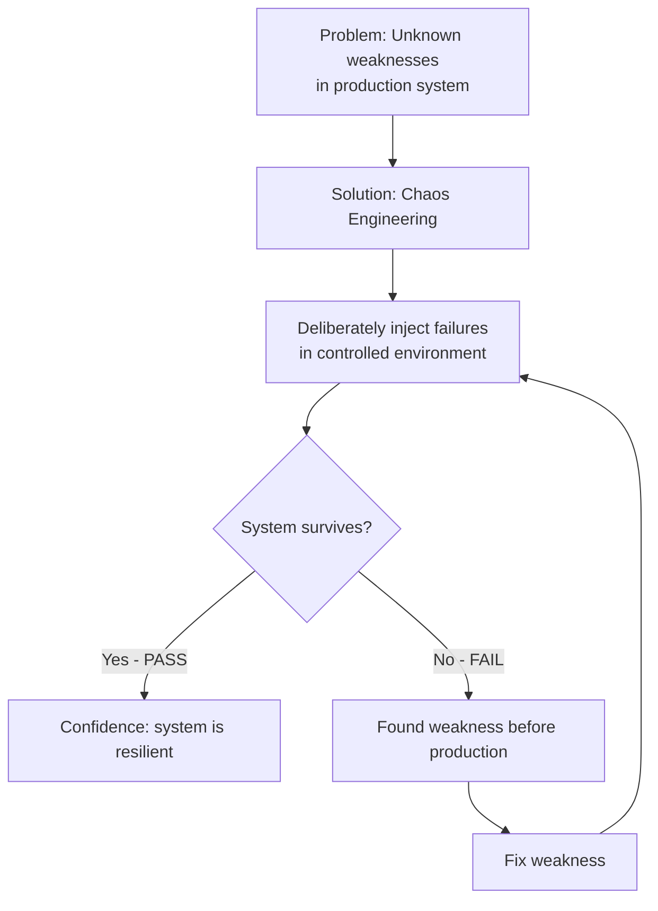
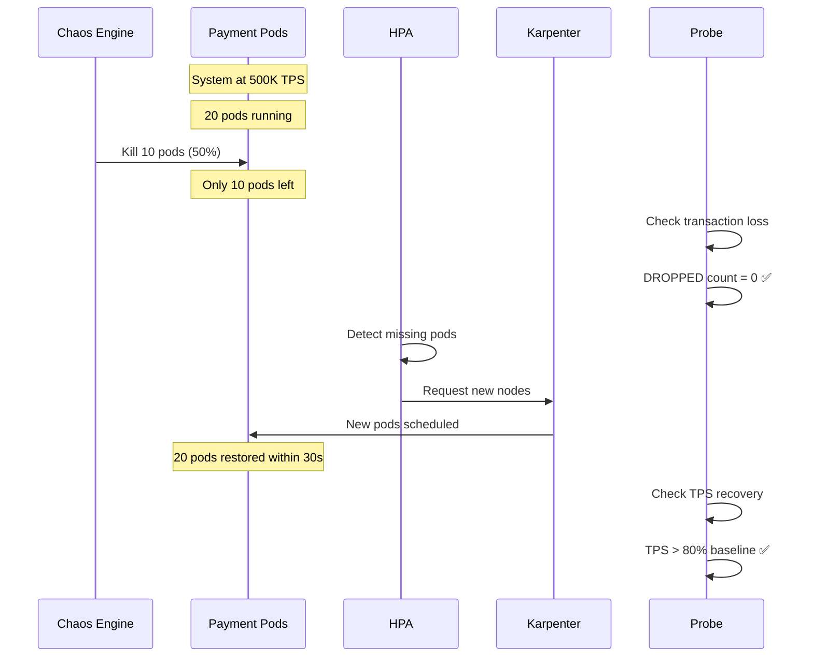
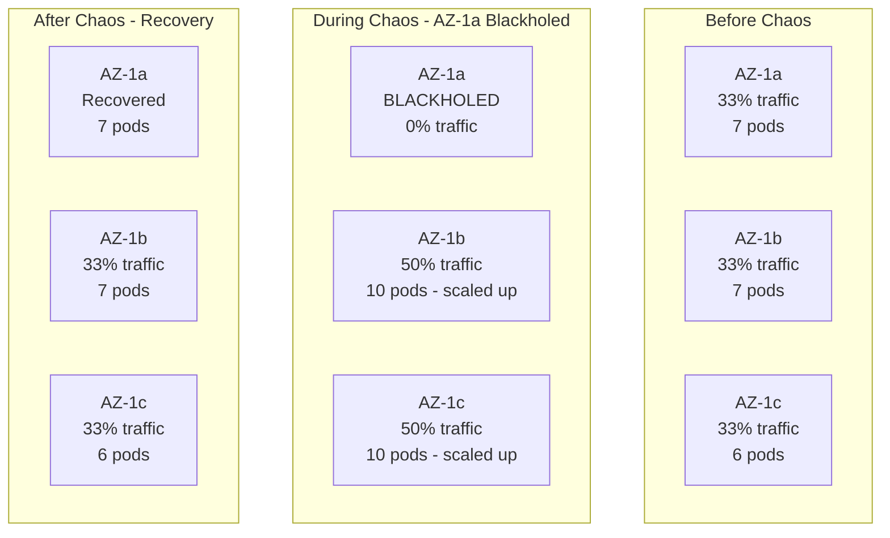
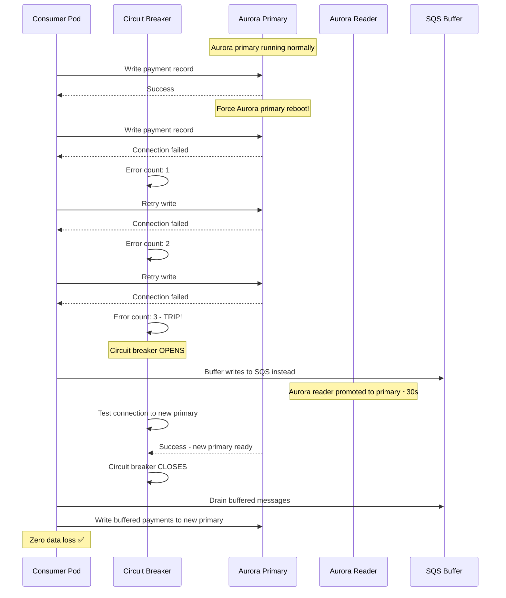
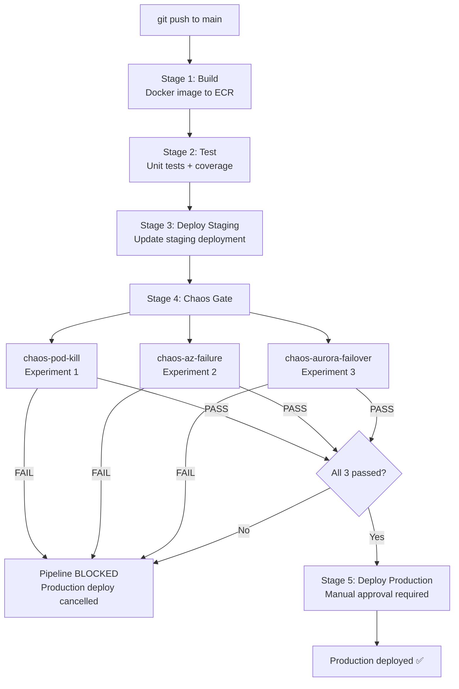

# Section E: Chaos Engineering

## Overview

This section describes three chaos experiments designed to
validate the payment platform before the 1M TPS event, and
how chaos testing is integrated into the CI/CD pipeline as
a hard gate before every production deployment.

---

## 1. Chaos Engineering Philosophy



### Why Chaos Before 1M TPS Event?

```
Without chaos testing:
Deploy system → hope it works → 1M TPS event
→ Unknown failure mode hits
→ Payment system down
→ Revenue loss + reputation damage ❌

With chaos testing:
Run experiments → find weaknesses → fix them
→ Run experiments again → all pass
→ 1M TPS event with confidence ✅
```

---

## 2. Experiment 1: Pod Kill at 500K TPS



### Steady-State Hypothesis

| Metric | Before Chaos | During Chaos | After Chaos |
|--------|-------------|--------------|-------------|
| Pod count | 20 | 10 (50% killed) | 20 (recovered) |
| Error rate | < 0.1% | May spike briefly | < 0.1% |
| p99 latency | < 500ms | May increase | < 500ms |
| TPS | 500,000 | May drop | > 400,000 (80%) |
| Transactions lost | 0 | 0 | 0 |

### Abort Condition

```
If error rate exceeds 5% for more than 10 seconds
→ Chaos engine stops immediately
→ Engineer investigates root cause
→ Fix issue before re-running experiment
```

---

## 3. Experiment 2: AZ Failure via Network Blackhole



### Validation Checklist

```
✅ System continues serving from AZ-1b and AZ-1c
✅ Karpenter provisions new nodes in surviving AZs within 60s
✅ HPA scales pods in surviving AZs to compensate
✅ Route 53 stops routing to AZ-1a automatically
✅ DLQ message count stays below 10
✅ System serves at minimum 66% of normal capacity
```

### Timeline

```
0s   : AZ-1a blackhole starts (100% packet loss)
5s   : Health checks to AZ-1a start failing
20s  : Route 53 detects AZ-1a unhealthy
30s  : HPA detects capacity drop, requests more pods
45s  : Karpenter provisions new nodes in AZ-1b and AZ-1c
60s  : New pods running in surviving AZs
120s : Chaos ends, AZ-1a restored
150s : Traffic rebalanced across all 3 AZs
```

---

## 4. Experiment 3: Aurora Failover Under Load



### Recovery Flow

```
Aurora primary fails
      │
      ▼
Circuit breaker opens (after 3 errors)
      │
      ▼
Writes buffered to SQS (~30 seconds)
      │
      ▼
Aurora reader promoted to new primary
      │
      ▼
Circuit breaker closes
      │
      ▼
Consumer drains SQS buffer to new primary
      │
      ▼
Zero data loss confirmed ✅
```

---

## 5. CI/CD Integration — Chaos as Hard Gate



### Why allow_failure: false?

```
allow_failure: true  (default):
Chaos experiment fails
→ Pipeline continues anyway
→ Broken code reaches production ❌

allow_failure: false (what we use):
Chaos experiment fails
→ Pipeline STOPS immediately
→ Production deployment BLOCKED
→ Engineer must fix and re-run ✅
```

### Pipeline Stages Summary

| Stage | What Happens | Gate? |
|-------|-------------|-------|
| build | Build and push Docker image | No |
| test | Run unit tests | Yes — fails block next stage |
| deploy-staging | Deploy to staging namespace | Yes |
| chaos | Run all 3 experiments | HARD GATE — all must pass |
| deploy-prod | Deploy to production | Manual approval required |

---

## 6. Litmus Chaos Framework

### Why Litmus?

```
Options considered:
1. Chaos Monkey (Netflix) — limited to instance termination
2. Gremlin — powerful but expensive SaaS
3. Litmus — open source, Kubernetes-native, CRD-based ✅

Litmus advantages:
- Native Kubernetes CRDs (ChaosEngine, ChaosExperiment)
- Built-in probes for validation
- GitOps friendly — experiments stored as YAML
- Free and open source
- Large experiment library (pod, network, node, AWS)
```

### Litmus Components

```
ChaosEngine    = the "what" — which experiment to run
                 and against which application

ChaosExperiment = the "how" — detailed parameters
                  for the chaos injection

ChaosResult    = the "outcome" — Pass or Fail verdict
                 with detailed probe results

Probe          = the "validator" — checks if system
                 meets steady-state hypothesis
```

---

## 7. Manifest Files Summary

| File | Purpose |
|------|---------|
| `chaos-pod-kill.yaml` | Kill 50% pods at 500K TPS — validate recovery |
| `chaos-az-failure.yaml` | Blackhole AZ-1a — validate multi-AZ resilience |
| `chaos-aurora-failover.yaml` | Force Aurora failover — validate circuit breaker |
| `gitlab-ci-chaos.yaml` | CI/CD pipeline with chaos as hard gate |

---

## 8. Key Design Decisions

### Decision 1: Three experiments cover three failure domains
Pod kill tests application layer resilience.
AZ failure tests infrastructure layer resilience.
Aurora failover tests data layer resilience.
Together they validate the full stack end-to-end.

### Decision 2: Chaos in staging not production
Running chaos in production during 1M TPS event is too risky.
Staging mirrors production configuration exactly.
If staging passes, production has same resilience guarantees.

### Decision 3: Hard gate with allow_failure false
Making chaos a soft gate (allow_failure true) defeats the purpose.
Engineers would ignore failed experiments and deploy anyway.
Hard gate enforces zero tolerance for resilience regressions.

### Decision 4: Manual approval after chaos passes
Even after all chaos experiments pass, human must approve.
Gives engineer chance to review experiment results.
Final sanity check before production traffic is affected.
