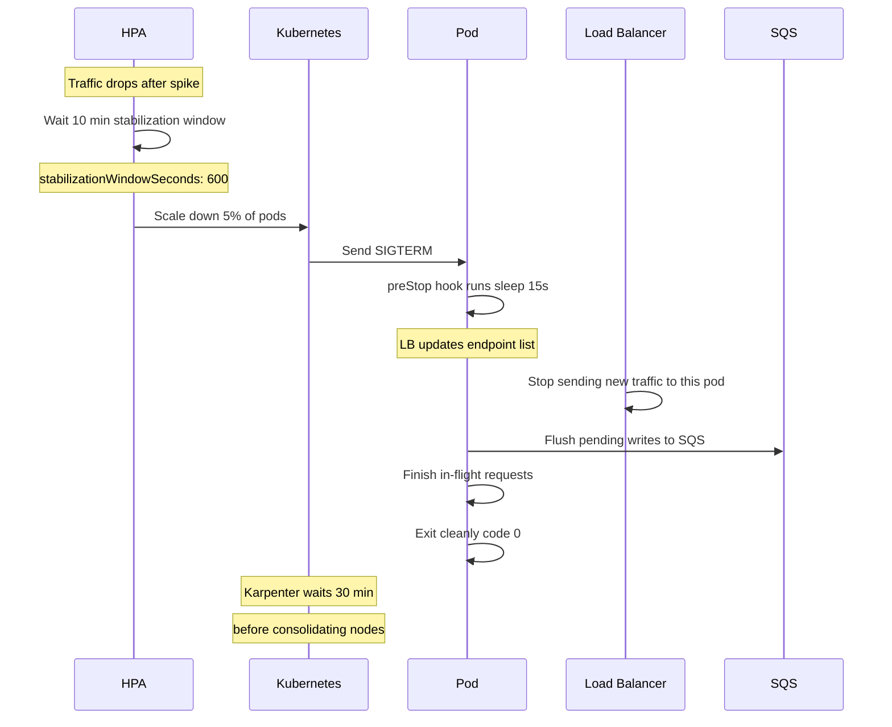
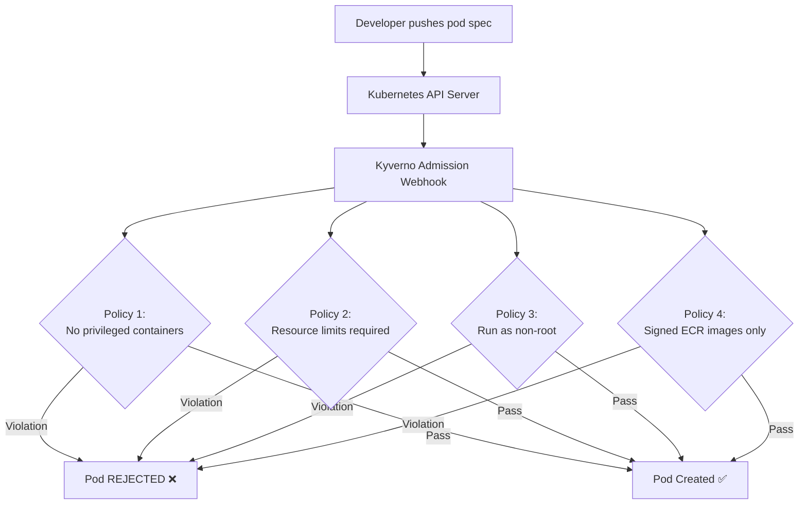
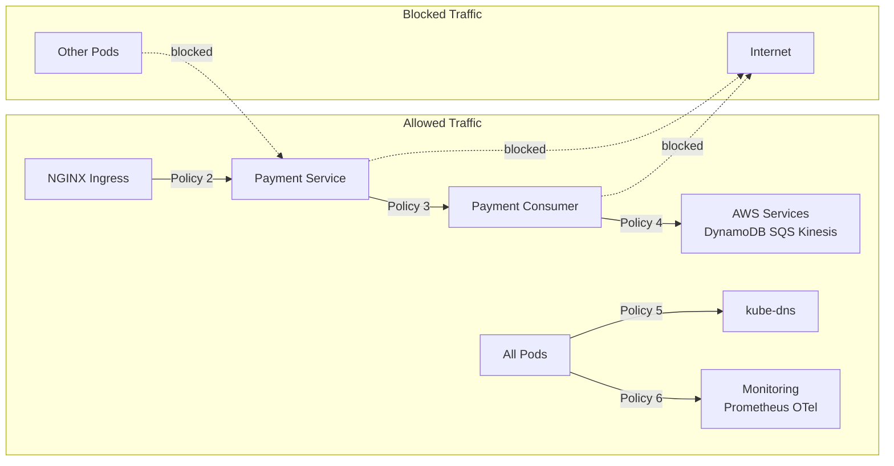
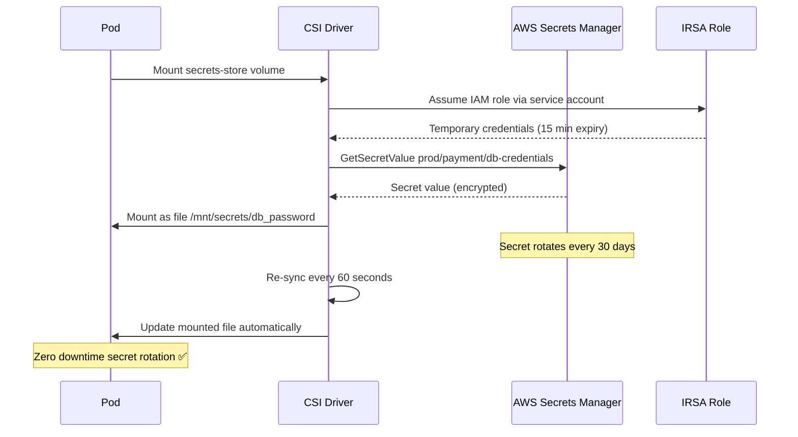
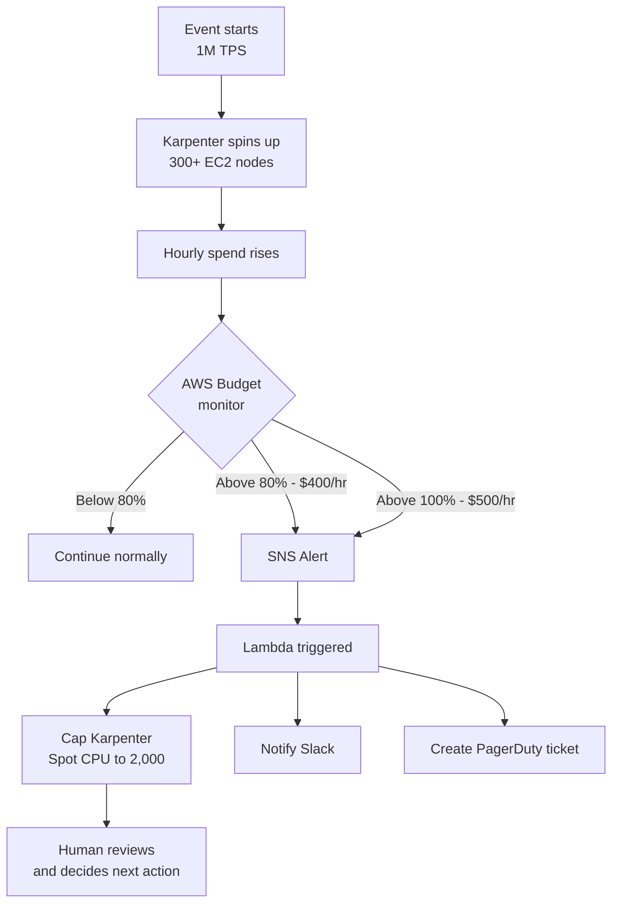
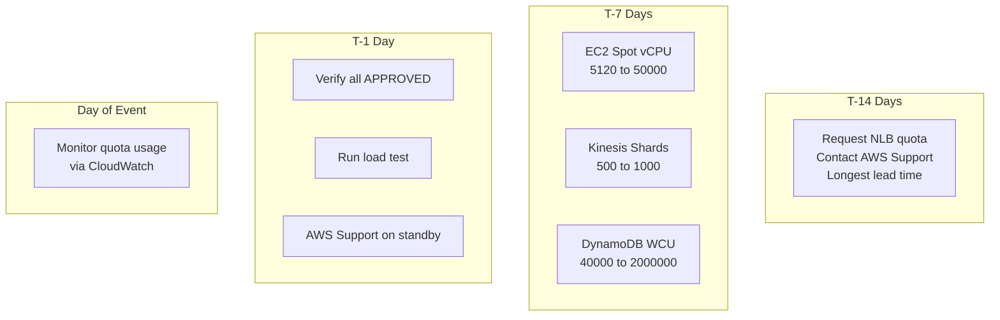
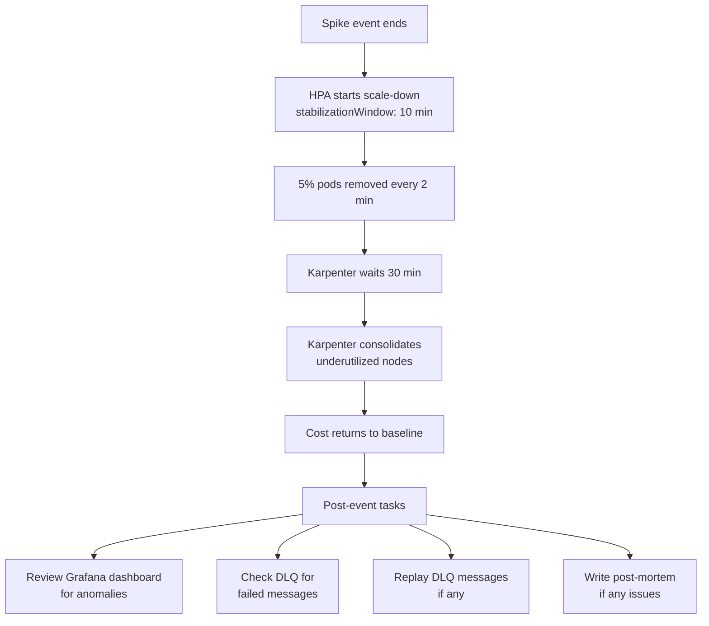

# Section F: Security, Cost & Post-Spike Operations

## Overview

This section describes how to scale down safely without dropping
in-flight transactions, what policies enforce security and prevent
cost overruns during the spike, and which AWS service quotas will
be hit and how to pre-warm them.

---

## 1. Graceful Scale-Down Flow



### Scale-Down Configuration

| Component | Setting | Value | Reason |
|-----------|---------|-------|--------|
| HPA stabilization | stabilizationWindowSeconds | 600s (10 min) | Wait for traffic to truly drop |
| HPA policy | Percent per period | 5% per 120s | Very gradual reduction |
| Pod termination | terminationGracePeriodSeconds | 60s | Time to finish in-flight requests |
| preStop hook | sleep | 15s | Time for LB to stop routing |
| Karpenter | consolidateAfter | 30m | Wait before removing nodes |

---

## 2. Security Policies (Kyverno)



### Why Each Policy?

| Policy | Risk Prevented | Impact |
|--------|---------------|--------|
| No privileged | Container escape to host node | Critical |
| Resource limits | One pod starving others | High |
| Run as non-root | Privilege escalation if compromised | High |
| Signed images only | Supply chain attack via malicious image | Critical |

---

## 3. Network Policies (Default Deny)



### Default Deny Principle

```
Without NetworkPolicy:
Any pod → Any pod → ALLOWED
Compromised monitoring pod → Payment pod → ALLOWED ❌

With Default Deny:
Any pod → Any pod → BLOCKED by default
Only explicitly whitelisted paths → ALLOWED ✅

Result: blast radius of any compromised pod is minimal
```

---

## 4. Secrets Management



### Why Not Kubernetes Secrets?

```
Kubernetes Secrets:
apiVersion: v1
kind: Secret
data:
  password: c3VwZXItc2VjcmV0   ← just base64, NOT encrypted!

Problems:
- Stored in etcd unencrypted (by default)
- Visible to anyone with kubectl get secret
- Appears in git history if committed
- No auto-rotation ❌

CSI Driver + Secrets Manager:
- Fetched directly from AWS at pod start
- Never stored in etcd
- Auto-rotates every 30 days
- IRSA: no hardcoded AWS credentials ✅
```

---

## 5. Cost Control Flow



### Cost Guardrails Summary

| Guardrail | Trigger | Action |
|-----------|---------|--------|
| AWS Budget 80% | $400/hr spend | SNS → Lambda |
| Lambda auto-cap | $400/hr spend | Reduce Spot CPU to 2,000 vCPU |
| Karpenter consolidation | Node underutilized 30 min | Remove unused nodes |
| Spot pricing | Spot interruption | Switch to On-Demand automatically |
| Kubecost | Daily cost report | Slack notification per namespace |

### Estimated Cost at 1M TPS

```
At peak (313 nodes c6i.4xlarge):
On-Demand : 94 nodes × $0.68/hr  = $63.92/hr
Spot      : 219 nodes × $0.20/hr = $43.80/hr
Total     : ~$107.72/hr

DynamoDB  : 1.2M WCU × $0.00065/hr = $780/hr
Redis     : 6 nodes r7g.2xlarge    = $12/hr
Kinesis   : 1,000 shards           = $15/hr

Grand total: ~$915/hr during peak
Budget cap : $500/hr for EC2 only
```

---

## 6. AWS Service Quotas



### Quota Requirements Table

| Service | Default Limit | Required | Lead Time | Action |
|---------|--------------|----------|-----------|--------|
| EC2 Spot vCPU | 5,120 | 50,000 | 1-3 days | Script |
| EC2 On-Demand vCPU | 5,120 | 10,000 | 1-3 days | Script |
| Kinesis Shards | 500/region | 1,000 | 1 day | Script |
| DynamoDB WCU | 40,000 | 2,000,000 | 2-3 days | Script |
| NLB Connections | 55,000/AZ | 350,000+/AZ | 5-7 days | AWS Support |
| EKS Node Groups | 30 | 50+ | 1 day | Script |
| CloudFront RPS | Unlimited | — | None needed | — |

---

## 7. Post-Spike Operations



### Post-Event Checklist

```
Immediately after spike:
[ ] Monitor error rate — should return to < 0.1%
[ ] Check DLQ depth — replay any failed messages
[ ] Verify DynamoDB WCU consumption dropping
[ ] Confirm Karpenter consolidation starting

Within 1 hour:
[ ] Review Grafana dashboard for anomalies
[ ] Check Kinesis consumer lag back to normal
[ ] Verify Redis cache hit rate normal
[ ] Confirm Aurora reconciliation caught up

Within 24 hours:
[ ] Write post-mortem document
[ ] Review cost report in Kubecost
[ ] Update runbook with lessons learned
[ ] File AWS Support case if any quota issues
```

---

## 8. Manifest Files Summary

| File | Type | Purpose |
|------|------|---------|
| `graceful-scaledown.yaml` | Kubernetes | HPA + Deployment + Karpenter scale-down config |
| `kyverno-policy.yaml` | Kyverno | Security policies — no privileged, resource limits, non-root, signed images |
| `network-policy.yaml` | Kubernetes | Default deny + explicit allow rules |
| `secrets-store-csi.yaml` | CSI Driver | Secrets from AWS Secrets Manager with auto-rotation |
| `cost-control.tf` | Terraform | AWS Budget + Lambda auto-cap + Spot fleet |
| `quota-checklist.sh` | Bash | Check and request AWS quota increases |

---

## 9. Key Design Decisions

### Decision 1: 10 minute HPA stabilization on scale-down
5 minute default is too aggressive — traffic may spike again.
10 minutes ensures the spike is truly over before reducing capacity.
Combined with 5% per 120s policy, scale-down takes 40+ minutes total.

### Decision 2: Kyverno over OPA/Gatekeeper
Both enforce policies at admission time.
Kyverno uses Kubernetes-native YAML — easier to read and maintain.
OPA requires Rego language — steeper learning curve for the team.
Kyverno also supports image verification natively.

### Decision 3: CSI Driver over Kubernetes Secrets
Kubernetes Secrets are base64 only — not truly encrypted at rest.
CSI Driver fetches secrets at runtime from AWS Secrets Manager.
Auto-rotation means zero manual work and zero rotation downtime.
IRSA eliminates need for any hardcoded AWS credentials.

### Decision 4: Lambda auto-cap at 80% budget
Waiting for 100% budget consumption before acting is too late.
At 80% ($400/hr) Lambda caps Spot fleet before hitting the limit.
Human review required to increase cap — prevents runaway automation.
